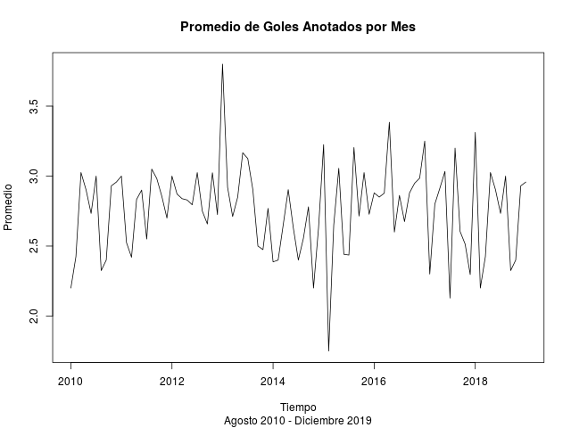

Postwork 6
===========
Equipo 13

- Jesus Antonio Hernandez Aguilera: antoniohdz_21@hotmail.com
- Angel Uriel Meléndez Rivera: amelendezr1100@alumno.ipn.mx
- Adalberto Benitez Zapata: adalb518@gmail.com
- Sergio Maldonado Rodriguez: sermalrod@outlook.com

## Desarrollo

1.  Importa el conjunto de datos y realiza lo siguiente:

``` r
#librerias necesarias
library(dplyr)
#paquete para usar años.
library(lubridate)
library(zoo)
library(ggplot2)
```

``` r
#Importamos el conjunto de datos de match.data.csv
#no podia descarga el csv, por eso uso directaemente el link de github
url <- 'https://raw.githubusercontent.com/beduExpert/Programacion-con-R-Santander/master/Sesion-06/Postwork/match.data.csv'
matchdata <- read.table(url, header = TRUE, sep = ',')
#View(matchdata)
#str(matchdata)

attach(matchdata)

#agregar una nueva columna sumagoles que contena la suma de goles por partido
matchdata['sumagoles'] <- matchdata[,3] + matchdata[,5]
```

2.  Obtén el promedio por mes de la suma de goles.

``` r
#obtener el promedio por mes de la suma de los goles
matchdata$date<- as.Date(matchdata$date) #modificar tipo de dato en el dataframe

matchdata['Mes'] <-months(matchdata$date)
matchdata['Año'] <-year(matchdata$date)

#Agrupamos los datos por año y mes, y sacamos el promedio de goles por mes
agrupado1 <- matchdata %>% group_by(Año,Mes)
agru <- agrupado1 %>% summarise(promedio.goles = mean(sumagoles))


df <- data.frame('Año' = agru$Año, 'Mes'=agru$Mes, 'Promedio de goles' = agru$promedio.goles) #organizamos como Dataframe

df$my <- as.yearmon(paste(df$Mes, df$Año)) #acomodamos Jan-Dic
df <- df[order(df$my),] #sorteamos correctamente
```

``` r
#Seleccionamos hasta diciembre de 2019
n <-dim(df)[1]-5
df <-df[1:n,]
head(df);tail(df)
```

    ##     Año       Mes Promedio.de.goles       my
    ## 1  2010    August          2.200000 Aug 2010
    ## 5  2010 September          2.425000 Sep 2010
    ## 4  2010   October          3.025641 Oct 2010
    ## 3  2010  November          2.902439 Nov 2010
    ## 2  2010  December          2.733333 Dec 2010
    ## 10 2011   January          3.000000 Jan 2011

    ##     Año       Mes Promedio.de.goles       my
    ## 93 2019       May          2.966667 May 2019
    ## 88 2019    August          2.269231 Aug 2019
    ## 96 2019 September          2.590909 Sep 2019
    ## 95 2019   October          2.564103 Oct 2019
    ## 94 2019  November          2.742857 Nov 2019
    ## 89 2019  December          2.777778 Dec 2019

3.  Crea la serie de tiempo del promedio por mes de la suma de goles
    hasta diciembre de 2019

``` r
class(df)
df <- ts(df[,3], start = 2010, end = 2019 ,frequency= 10)

class(df)
```

``` r
df
```

    ## Time Series:
    ## Start = c(2010, 1) 
    ## End = c(2019, 1) 
    ## Frequency = 10 
    ##  [1] 2.200000 2.425000 3.025641 2.902439 2.733333 3.000000 2.325000 2.400000
    ##  [9] 2.930233 2.957447 3.000000 2.525000 2.420000 2.833333 2.900000 2.550000
    ## [17] 3.050000 2.981818 2.854545 2.700000 3.000000 2.871795 2.838710 2.829268
    ## [25] 2.794872 3.025000 2.750000 2.657895 3.023810 2.725000 3.800000 2.920000
    ## [33] 2.711111 2.850000 3.166667 3.125000 2.902439 2.500000 2.474576 2.769231
    ## [41] 2.387097 2.400000 2.650000 2.903226 2.631579 2.400000 2.555556 2.780488
    ## [49] 2.200000 2.633333 3.225000 1.750000 2.650000 3.055556 2.441176 2.435897
    ## [57] 3.204082 2.714286 3.025000 2.727273 2.880000 2.850000 2.878049 3.384615
    ## [65] 2.600000 2.862069 2.675000 2.880952 2.948718 2.985294 3.250000 2.300000
    ## [73] 2.800000 2.914286 3.033333 2.128205 3.200000 2.604167 2.513514 2.296296
    ## [81] 3.312500 2.260870 2.644444 2.375000 2.709677 2.526316 2.756098 2.300000
    ## [89] 2.725000 2.550000 2.966667

4.  Grafica la serie de tiempo.

``` r
#png(filename='plot1.png',width = 640,height = 480)
plot(df, main = 'Promedio de Goles Anotados por Mes', xlab = 'Tiempo', ylab= 'Promedio', sub= 'Agosto 2010 - Diciembre 2019')
```



``` r
#dev.off()
```
